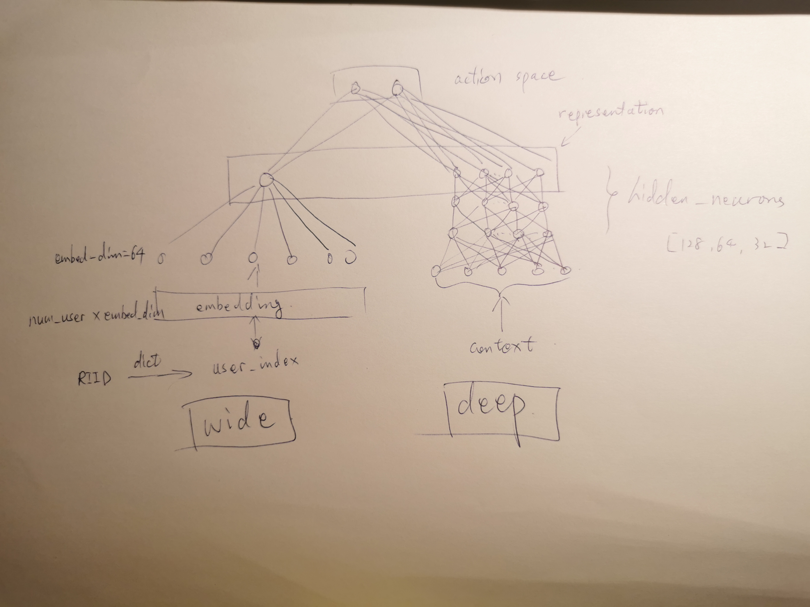

# Demo of a Wide and Deep model based on the code of space-bandits

The codes in neural_bandit_model.py, neural_linear.py and contextual_dataset.py are modified to replace the default Neuron Network of space-bandit with a wide and deep model

Please see the demo.ipynb.
